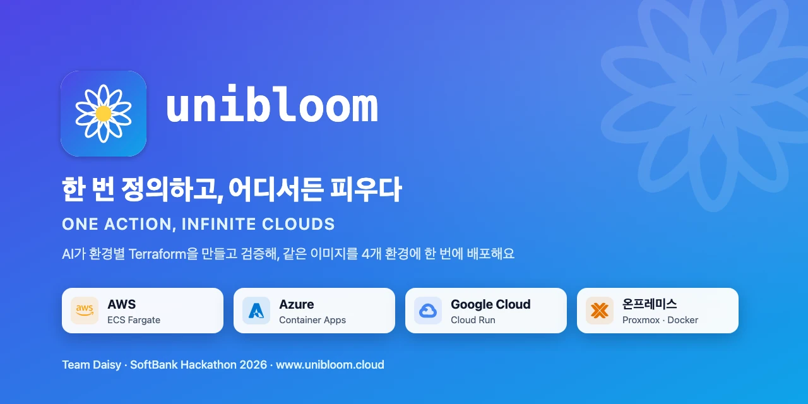
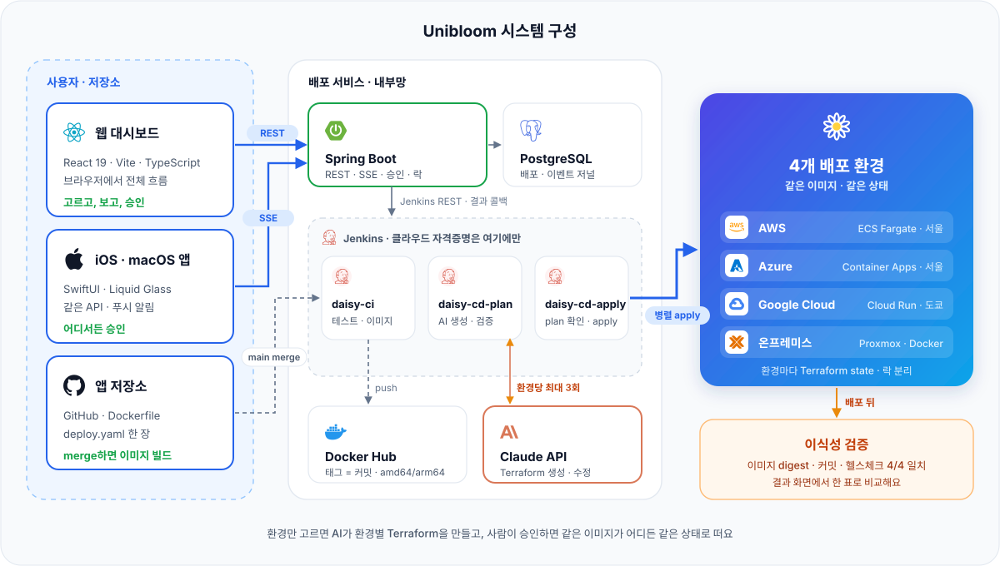
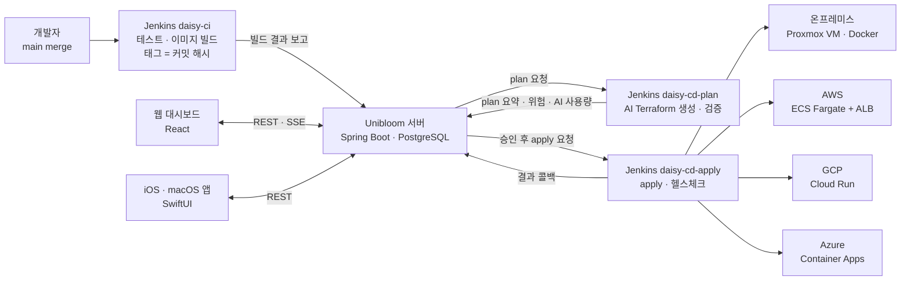
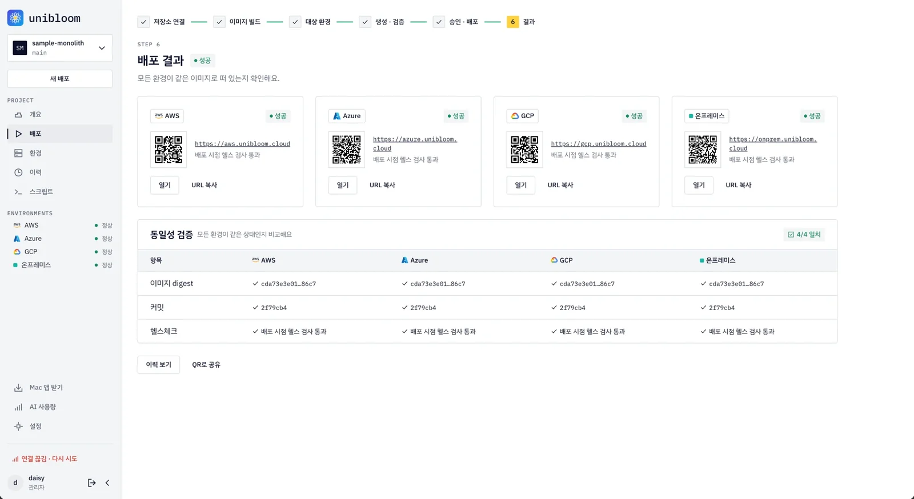
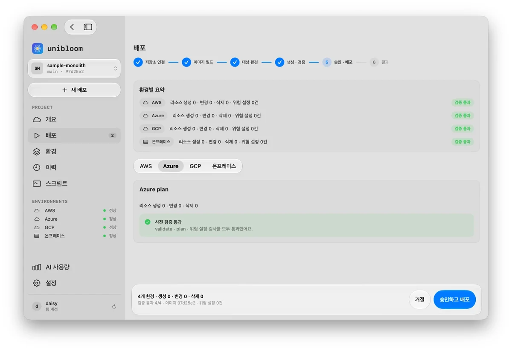
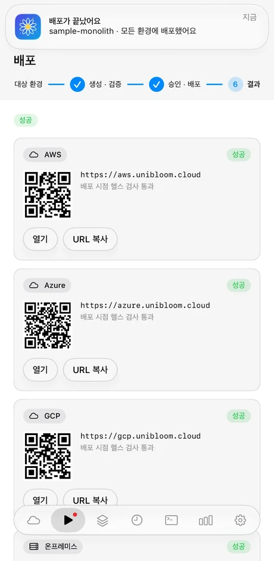

# Unibloom — 한 번 정의하고, 어디서든 피우다

**AI 기반 온프레미스 · 퍼블릭 클라우드 원터치 배포 시스템**
SoftBank Hackathon 2026 in Korea 예선 (Term 1) · Team Daisy

배포할 환경만 고르면 AI가 환경마다 인프라 코드(Terraform)를 만들고 검증해요. 사람이 plan을 승인하면, **같은 이미지(커밋 해시)를 온프레미스와 퍼블릭 클라우드(AWS · GCP · Azure)에 동시에** 배포해요. 핵심은 이식성 — 어디에 배포해도 같은 상태예요.

## 바로 써 보기

| 무엇 | 주소 |
|---|---|
| 웹 대시보드 | https://www.unibloom.cloud |
| API (개발 서버) | https://api.unibloom.cloud · 문서 `/v3/api-docs`, `/swagger-ui.html` |
| Mac 앱 (공증된 DMG) | [Unibloom.dmg 내려받기](https://github.com/Softbank-Hackathon-2026-Team-Daisy/unibloom/releases/download/mac-latest/Unibloom.dmg) · macOS 15 이상 |
| iPhone 앱 (TestFlight) | [TestFlight로 설치](https://testflight.apple.com/join/wF5sjQPG) · 공개 링크로 바로 설치돼요 (iOS 18 이상) |
| Unibloom으로 배포한 샘플 앱 (HelloCalc) | [온프레미스](https://onprem.unibloom.cloud) · [AWS](https://aws.unibloom.cloud) · [GCP](https://gcp.unibloom.cloud) · [Azure](https://azure.unibloom.cloud) — 네 곳 모두 `/version`이 같은 커밋을 돌려줘요 |

웹 · 앱 모두 **한국어 · English · 日本語**를 지원해요 (웹: 설정 · 로그인 화면, 앱: 설정 › 언어. 기본값은 브라우저 · 기기 언어).

데모 계정은 심사위원께 따로 전달해요. 앱은 로그인 없이 **"예시 데이터로 둘러보기 (오프라인)"** 로 모든 화면을 볼 수 있어요 (화면마다 "예시 데이터" 배지).

## 어떻게 동작하나요

요청 흐름 (Mermaid)

1. **앱 연결 (한 번)** — 사용자 저장소에 `Dockerfile`과 `deploy.yaml`(포트 · 헬스체크 · 환경변수 · DB 여부)을 둬요.
2. **이미지 빌드** — main에 머지하면 Jenkins `daisy-ci`가 테스트하고 커밋 해시로 태그한 이미지를 올린 뒤 서버에 알려요.
3. **환경 선택** — 웹이나 앱에서 배포할 환경을 여러 개 골라요 (온프레미스 · AWS · GCP · Azure).
4. **AI 생성 · 검증** — `daisy-cd-plan`이 환경별 Terraform을 만들고 `validate` → `plan` → 위험 설정 검사를 해요. 실패하면 AI가 로그를 읽고 고쳐요 (환경당 최대 3번). 검증된 스크립트가 있으면 이미지 태그만 바꿔 재사용해요 (AI 0회).
5. **사람이 승인** — 리소스 변경(`+생성 ~변경 −삭제`)과 위험 설정, AI 비용(추정)을 보고 승인해요. 승인 없이는 인프라가 바뀌지 않아요.
6. **병렬 배포** — `daisy-cd-apply`가 환경마다 apply하고 헬스체크해요. 한 환경이 실패해도 나머지는 계속돼요.
7. **결과 · 동일성 검증** — 환경마다 공개 URL, 같은 이미지 digest · 커밋인지 확인해요. 롤백은 이전 성공 커밋으로 만드는 새 배포(승인 필요)예요.

## 실제로 확인한 것 (10/2 밤, 개발 서버)

웹 대시보드에서 네 환경을 한 번에 골라 끝까지 배포했어요.

| 단계 | 결과 |
|---|---|
| 첫 배포 (v1.2.0, `2f79cb4`) | plan에서 네 환경 Terraform을 AI가 새로 생성(AI 호출 4회, 약 821원) → 웹에서 승인 → 병렬 apply |
| 같은 버전 재배포 | 검증된 스크립트 재사용으로 **AI 호출 0회** → 네 환경 모두 성공, 헬스체크 200 |
| 동일성 | `onprem` · `aws` · `gcp` · `azure`.unibloom.cloud의 `/version`이 모두 `2f79cb4` |

<table>
<tr>
<td width="44%" valign="top"> <b>웹</b> — 배포 결과 · 4개 환경 digest · 커밋 · 헬스체크 4/4 일치</td>
<td width="36%" valign="top"> <b>Mac 앱</b> — 환경별 plan을 보고 승인</td>
<td width="20%" valign="top"> <b>iPhone 앱</b> — 결과 · 푸시 알림</td>
</tr>
</table>

더 많은 화면은 [조직 소개 페이지](https://github.com/Softbank-Hackathon-2026-Team-Daisy)에 있어요.

| 환경 | 실행 위치 |
|---|---|
| 온프레미스 | Proxmox VM의 Docker |
| AWS | ECS Fargate + ALB (ap-northeast-2) |
| GCP | Cloud Run (asia-northeast1) |
| Azure | Container Apps (koreacentral) |

환경마다 Terraform state를 따로 두고 잠가요 (자세한 저장소는 [`infra/SPEC.md`](./infra/SPEC.md) §7).

## 폴더와 담당

| 폴더 | 내용 | 기술 | 담당 |
|---|---|---|---|
| `web/` | 웹 대시보드 (전체 흐름) | React · Vite · TypeScript | 김도영 |
| `ios/` | iOS · macOS 앱 (전체 흐름 · 알림) | SwiftUI 멀티플랫폼 | 박승준 |
| `server/` | 배포 서비스 API · 상태 · 승인 · Jenkins 연동 · SSE | Spring Boot 3.5 · Java 21 · PostgreSQL | 하은현 · 김승환 |
| `infra/ai/` | AI Terraform 생성 · 수정 · 위험 검사 | Python · Claude | 임채준 |
| `infra/jenkins/` | CI · CD 파이프라인 | Jenkins | 임채준 · 황지환 |
| `infra/modules/` | 환경별 기준 Terraform 모듈 | Terraform | 황지환(온프레미스) · 임채준(AWS · GCP · Azure) |
| `docs/` | 문서 · ADR 사본 | | 전원 |

배포 대상 샘플 앱은 별도 레포 [`sample-monolith`](https://github.com/Softbank-Hackathon-2026-Team-Daisy/sample-monolith)(HelloCalc)와 [`sample-msa`](https://github.com/Softbank-Hackathon-2026-Team-Daisy/sample-msa)에 있어요.

## 로컬에서 실행하기

- **서버**: [`server/README.md`](./server/README.md) — Java 21 · PostgreSQL, `./gradlew bootRun`
- **웹**: `cd web && pnpm install && pnpm dev` — `.env.example`을 `.env.local`로 복사해요. 기본은 목업(`VITE_USE_MOCK=true`)이고, 개발 서버에 붙이려면 파일 안 안내대로 바꿔요.
- **앱**: `open ios/Daisy.xcodeproj` 후 실행 (Xcode 27, iOS 18 · macOS 15). 앱은 늘 `api.unibloom.cloud`에 붙어요.
- **인프라**: [`infra/SPEC.md`](./infra/SPEC.md) — `terraform validate` · `plan`까지는 자유, `apply`는 사람 승인 뒤에만 실행해요.

## 설계 문서

- 설계 결정 기록(ADR) · 회의록 · PoC 계획: [팀 Notion](https://app.notion.com/p/5218bee9ada483ecba4881553589f692)
- 팀 결정 보드 (시간순, 근거 링크 포함): [`BOARD.md`](./BOARD.md)
- 공통 규칙 · 영역 · 계약: [`AGENTS.md`](./AGENTS.md) · 작업 규칙: [`CONTRIBUTING.md`](./CONTRIBUTING.md)
- 영역별 명세: [`web/SPEC.md`](./web/SPEC.md) · [`ios/SPEC.md`](./ios/SPEC.md) · [`server/SPEC.md`](./server/SPEC.md) · [`infra/SPEC.md`](./infra/SPEC.md)

## 팀

김도영(팀장 · Web) · 박승준(iOS · macOS 앱) · 하은현(Backend) · 김승환(Backend) · 황지환(Infra · 온프레미스) · 임채준(Infra · 클라우드 · AI)
